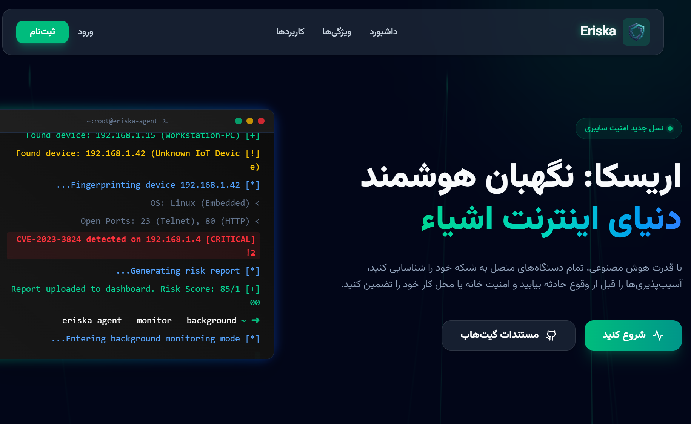
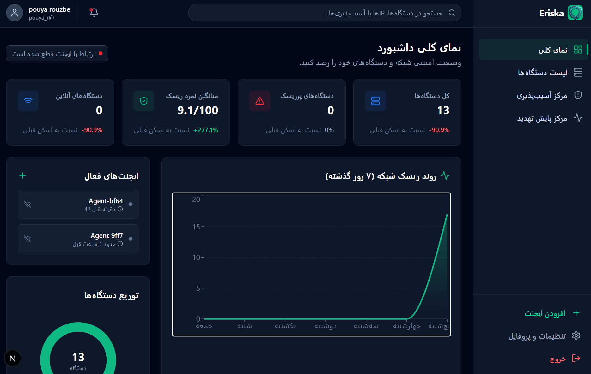
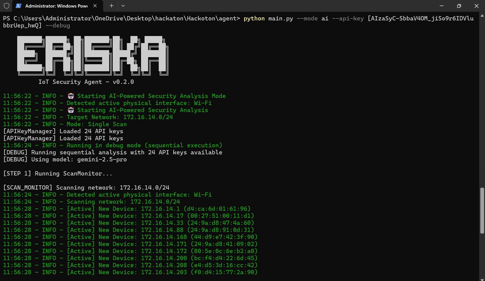
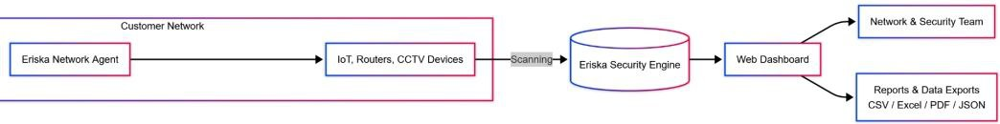

# Eriska IoT Security Platform

<div align="center">
  <br />
  <h1>🛡️ Eriska</h1>
  <p><strong>Next-Generation IoT Security Scanner & Vulnerability Assessment Platform</strong></p>
  
  <p>
    <a href="docs/installation.md"><strong>Installation Guide</strong></a> ·
    <a href="docs/architecture.md"><strong>Architecture</strong></a> ·
    <a href="https://github.com/ghasemmazandarani/eriska/issues"><strong>Report Bug</strong></a> ·
    <a href="https://github.com/ghasemmazandarani/eriska/issues"><strong>Request Feature</strong></a>
  </p>

  [](https://opensource.org/licenses/MIT)
  [](https://www.python.org/)
  [](https://nextjs.org/)
  [](http://makeapullrequest.com)
</div>

---

## 📖 Overview

**Eriska** is an open-source, AI-powered security platform designed specifically for Internet of Things (IoT) networks. It goes beyond simple port scanning to provide deep, context-aware security analysis for smart devices, cameras, and routers.

By leveraging **Generative AI (Gemini 2.5 Pro)** and **LangGraph**, Eriska orchestrates a team of specialized agents to discover devices, identify vulnerabilities (CVEs), analyze attack paths, and suggest remediation steps—all in plain English.

---

## ✨ Key Features

### 🧠 AI-Powered Analysis
*   **Multi-Agent System**: Orchestrates 5 specialized agents (ScanMonitor, DeviceIdentifier, CVEHunter, AttackPath, DebateSynthesis).
*   **Context-Aware**: Understands the role of each device in your network.
*   **Plain English Reports**: Explains complex security risks in simple terms.

### 🔍 Deep IoT Scanning
*   **Camera Mode**: Specialized audit for IP cameras (ONVIF, RTSP, default credentials).
*   **Router Mode**: Analyzes router configuration and connected clients.
*   **Device Fingerprinting**: Uses RAG to identify vendors, models, and firmware versions with high precision.

### 🛡️ Vulnerability Management
*   **CVE Correlation**: Automatically matches devices against a massive database of known vulnerabilities.
*   **Risk Scoring**: Dynamic risk scoring based on device exposure and configuration.
*   **Attack Path Analysis**: Identifies potential lateral movement paths in your network.

### 🌐 Modern Dashboard
*   **Real-time Visualization**: See your network topology and security status at a glance.
*   **Responsive Design**: Built with Next.js 16 and TailwindCSS for a beautiful experience on any device.

---

## 📸 Screenshots

### Landing Page
> The entry point to the Eriska platform.



### Dashboard Overview
> Visualize your entire network topology and security status in one glance.



### Security Agent CLI
> Powerful command-line interface for advanced users and automation.



---

## 🏗️ Architecture

Eriska follows a modular architecture with a clear separation between the Edge (Agent), Core (Backend), and Presentation (Frontend) layers.



For a detailed deep-dive into the system design, please read the **[Architecture Documentation](docs/architecture.md)**.

---

## 🚀 Quick Start

For detailed installation instructions, please refer to the **[Installation Guide](docs/installation.md)**.

### 1. Clone the Repository

```bash
git clone https://github.com/ghasemmazandarani/eriska.git
cd eriska
```

### 2. Run the Security Agent (AI Mode)

```bash
cd agent
pip install -r requirements.txt
python main.py --mode ai --api-key YOUR_GEMINI_API_KEY
```

### 3. Run the Dashboard (Optional)

```bash
cd front
npm install
npm run dev
```

---

## 🧩 Components

| Component | Description | Tech Stack |
|-----------|-------------|------------|
| **[Agent](docs/agent-v2.md)** | The brain of the operation. Performs scanning and AI analysis. | Python, LangGraph, Gemini |
| **[Backend](backend/README.md)** | Central API and data storage. | Django REST Framework, PostgreSQL |
| **[Frontend](front/README.md)** | User interface for visualization and management. | Next.js 16, TailwindCSS |

---

## 🤝 Contributing

We welcome contributions from the community! Whether it's fixing a bug, adding a new feature, or improving documentation, your help is appreciated.

Please read our **[Contributing Guidelines](CONTRIBUTING.md)** before getting started.

---

## 📄 License

This project is licensed under the **MIT License**. See the [LICENSE](LICENSE) file for details.

---

<div align="center">
  <p>Made with ❤️ by the Eriska Team</p>
</div>