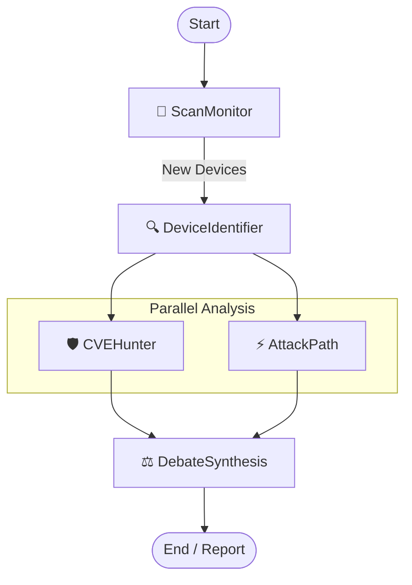

# Eriska Agent V2

Agent V2 is the next-generation security scanner for the Eriska platform. It features a modular design, improved performance, and a groundbreaking **AI-Powered Analysis Engine**.

## 🧠 AI Architecture (LangGraph)

The core of Agent V2 is a multi-agent system built with **LangGraph** and **Gemini 2.5 Pro**. It orchestrates five specialized agents to perform a comprehensive security audit.

### The 5-Agent Workflow



1.  **ScanMonitor**: Continuously watches the network. When it detects a new device or a change in an existing one, it triggers the workflow.
2.  **DeviceIdentifier**: Uses **RAG (Retrieval-Augmented Generation)** to query a vector database of device fingerprints. It identifies the vendor, model, and firmware version with high precision.
3.  **CVEHunter**: Takes the identified device info and searches a massive CVE database for known vulnerabilities.
4.  **AttackPath**: Runs in parallel with CVEHunter. It analyzes the network topology to find potential lateral movement paths (e.g., "Can an attacker move from this camera to the server?").
5.  **DebateSynthesis**: The final verifier. It reviews the findings from CVEHunter and AttackPath, challenges them (to remove false positives), and synthesizes a final, human-readable report.

## Key Features

*   **Modular Architecture**: Separate modules for Discovery, Fingerprinting, and Analysis.
*   **Multi-Mode Scanning**:
    *   **Network Mode**: Standard active/passive network scanning.
    *   **Router Mode**: Scans devices connected to a specific router.
    *   **Camera Mode**: Deep analysis of IP cameras (ONVIF, RTSP).
    *   **AI Mode**: Full multi-agent analysis.
*   **Enhanced Fingerprinting**: Better detection of IoT device types using protocol-specific probes.

## Usage

The agent is controlled via the `main.py` script.

### 1. AI-Powered Analysis (Recommended)
Uses Generative AI to analyze the network context and findings.

```bash
python main.py --mode ai --api-key YOUR_GEMINI_API_KEY
```

**Continuous Monitoring:**
```bash
python main.py --mode ai --continuous --interval 300
```

### 2. Network Scan (Standard)
Scans the local network interface.

```bash
python main.py --mode active --iface eth0
```

### 3. Router Scan
Connects to a router to get a list of connected devices.

```bash
python main.py --mode router \
    --router-ip 192.168.1.1 \
    --router-user admin \
    --router-pass password \
    --router-type tp-link
```

### 4. Camera Security Audit
Performs a deep security audit on a specific camera.

```bash
python main.py --mode camera \
    --camera-ip 192.168.1.100 \
    --camera-user admin \
    --camera-pass 123456 \
    --camera-type hikvision
```

## Configuration

The agent can be configured via `config.ini` or environment variables.

| Variable | Description | Default |
|----------|-------------|---------|
| `ERISKA_BACKEND_URL` | URL of the Eriska Backend | `http://localhost:8000/api` |
| `GEMINI_API_KEY` | API Key for AI features | `None` |
| `LOG_LEVEL` | Logging verbosity | `INFO` |

## Directory Structure

*   `core/`: Core logic for scanning and analysis.
*   `utils/`: Helper functions (logging, networking).
*   `ai/`: AI integration modules (LangGraph agents).
