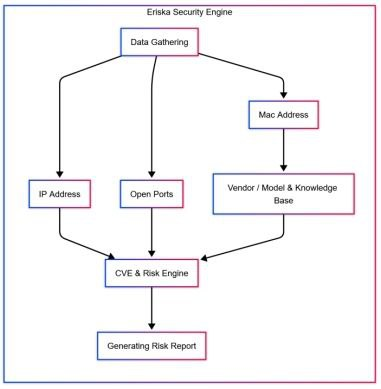

# System Architecture

Eriska is designed as a modular, distributed security platform. This document outlines the high-level architecture and the interaction between components.

## High-Level Overview

The system consists of three main layers:

1.  **Edge Layer (Agents)**: Deployed on the local network to perform scanning and data collection.
2.  **Core Layer (Backend)**: Central server for processing data, managing agents, and storing results.
3.  **Presentation Layer (Frontend)**: Web interface for users to interact with the system.

## Component Details

### 1. Security Agent (Edge)
The agent is the "eyes and ears" of the system. It runs on a device within the target network (e.g., a Raspberry Pi, a laptop, or a server).

*   **Discovery Engine**: Uses ARP, UPnP, and mDNS to find devices.
*   **Fingerprinting Module**: Identifies device types (Camera, Printer, Router) using OUI lookup, port patterns, and protocol-specific probes (ONVIF, HTTP headers).
*   **Vulnerability Scanner**: Checks for known CVEs and weak configurations (default passwords).
*   **Communication**: Sends data to the backend via a secure REST API.

### 2. Backend Server (Core)
The backend acts as the brain of Eriska.

*   **API Gateway**: Handles incoming requests from Agents and the Frontend.
*   **Data Processing**: Normalizes data received from different agents.
*   **Risk Engine**: Calculates risk scores based on a weighted algorithm (Vulnerabilities + Configuration + Environment).
*   **Database**: Stores device inventory, scan history, and CVE data.

### 3. Frontend Dashboard (UI)
The user interface provides a visual representation of the network security posture.

*   **Network Map**: Visualizes the topology of the network.
*   **Device Inventory**: List of all discovered devices with their details.
*   **Risk Dashboard**: Charts and graphs showing the overall security health.
*   **Reports**: Generates PDF/HTML reports for compliance.

## Data Flow

1.  **Scan Initiation**: User starts a scan from the Dashboard OR Agent runs a scheduled scan.
2.  **Discovery**: Agent scans the local subnet.
3.  **Analysis**: Agent fingerprints devices and checks for vulnerabilities.
4.  **Reporting**: Agent sends the results (JSON) to the Backend.
5.  **Processing**: Backend processes the data, calculates risk scores, and updates the Database.
6.  **Visualization**: Frontend polls the Backend and updates the UI.
